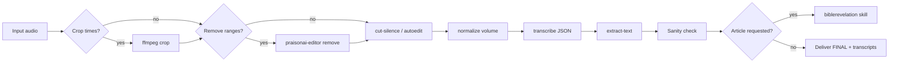

# Local sermon audio — full pipeline

Run on the user's Mac. **Do not stop at instructions.**

## Golden rule

When the user provides **local audio** (`.wav` / `.m4a`) and asks you to process / transcribe / prepare for Spotify or article — **run the full pipeline below in order**. Skip a step **only** if the user explicitly says so (e.g. "don't cut silence") or the file is already the output of that step (e.g. already `_ALTERED`).

For **YouTube URL** → [youtube-clip-transcribe](../youtube-clip-transcribe/SKILL.md) (download + crop + normalise), then transcribe rules here from Step 5.

For **transcript → article** → [biblerevelation-sermon-articles](~/.cursor/skills/biblerevelation-sermon-articles/SKILL.md) or [biblerevelation-create-post](~/.cursor/skills/biblerevelation-create-post/SKILL.md).

## Prerequisites

| Tool | Check |
|------|--------|
| `OPENAI_API_KEY` | `bash -lc 'test -n "$OPENAI_API_KEY" && echo ok'` |
| Repo | `~/praisonai-audio-editor` |
| `ffmpeg` / `ffprobe` | `ffmpeg -version` |

**Shell:** `bash -lc '…'` so `~/.bashrc` loads the API key.

## Full pipeline (local audio)



## Checklist — run all unless skipped by user

```
- [ ] Step 1: Time crop (if user gave start/end on a longer file)
- [ ] Step 2: Remove time ranges (if user asked to cut a section)
- [ ] Step 3: Silence cut (cut-silence.py → *_ALTERED*)
- [ ] Step 4: Volume normalise — report mean/max before & after
- [ ] Step 5: ffprobe duration on working file
- [ ] Step 6: Choose language mode (Tamil+English → omit --language)
- [ ] Step 7: Optional --speed 2 quality test (5 min sample)
- [ ] Step 8: transcribe --format json
- [ ] Step 9: extract-text → .transcript.txt
- [ ] Step 10: Sanity check (duration, words, English scripture)
- [ ] Step 11: Copy/symlink deliverable → {stem}_FINAL.m4a (or .wav)
- [ ] Step 12: Article / Spotify copy (only if user asked)
```

Work in `~/praisonai-audio-editor/`. Keep `{stem}` consistent across steps; update `AUDIO=` after each step.

## Output naming

| Stage | Typical file |
|-------|----------------|
| Cropped | `{stem}_{start}_to_{end}.wav` |
| After remove | `{stem}_cut.wav` |
| After silence cut | `{stem}_ALTERED.wav` |
| After normalise | `{stem}_norm.m4a` |
| **Final deliverable** | `{stem}_FINAL.m4a` (symlink or copy of last step) |
| Transcript | `{stem}_FINAL.transcript.json` / `.txt` |
| Log | `{stem}_FINAL_transcribe.log` |

Transcribe the **normalised** file so Spotify/article match the published audio.

---

## Step 1 — Time crop (optional)

When user gives **start/end** on a longer local file:

```bash
ffmpeg -y -nostdin -i "$SRC" -ss START -to END -map 0:a:0 -c copy "${STEM}_cropped.wav"
# end of file: omit -to, use -ss only
AUDIO="${STEM}_cropped.wav"
```

`-to` is **absolute** on the source timeline (same rule as YouTube skill).

---

## Step 2 — Remove time ranges (optional)

When user asks to **cut out** a clock-time section (e.g. `11:53 to 12:43`):

```bash
python3 -m praisonai_editor remove "$AUDIO" --range "11:53-12:43" \
  -o "${STEM}_cut.wav" -v
AUDIO="${STEM}_cut.wav"
```

Multiple cuts: repeat `-r START-END`. SDK: `remove_time_ranges()`. Agent: `audio_remove_range_tool`.

**Not the same as:** `trim` (phrase keep) · `edit` (fillers).

---

## Step 3 — Silence cut (default: run)

Remove long silent gaps. Default threshold **−30 dB** peak (Tamil sermon noise floor).

```bash
python3 ~/praisonai-audio-editor/mac/cut-silence.py "$AUDIO"
# → {stem}_ALTERED.wav (or pass explicit output path)
AUDIO="${STEM}_ALTERED.wav"
```

Tune via env: `CUT_SILENCE_NOISE_DB=-30` `CUT_SILENCE_MIN=1.5` `CUT_SILENCE_MARGIN=0.3`.

Quick Action alternative: `mac/autoedit-audio.sh "$AUDIO"`.

**Skip only** if user says no silence cut or file is already `_ALTERED`.

---

## Step 4 — Volume normalise (default: run)

Target: **−16 LUFS**, **−1.5 dBTP** (Spotify / podcast). **Always measure and report** before & after.

```bash
# Measure first
ffmpeg -hide_banner -nostdin -i "$AUDIO" -af volumedetect -f null - 2>&1 | grep -E "mean_volume|max_volume"

cd ~/praisonai-audio-editor
python3 -m praisonai_editor normalize "$AUDIO" -o "${STEM}_norm.m4a"
# .m4a input: --in-place OK
# hot peaks (max ≥ −1 dB): add --force
```

| Condition | Action |
|-----------|--------|
| mean &lt; −22 dB or max &lt; −8 dB | Auto loudnorm |
| mean −22…−14, max −8…−2 | Usually skip (copies file) — still run command to verify |
| mean &gt; −12 dB or max ≥ −1 dB | `--force` |

Wrapper: `scripts/optimize-audio-volume.sh`

```bash
AUDIO="${STEM}_norm.m4a"
ln -sf "$(realpath "$AUDIO")" "${STEM}_FINAL.m4a"   # or cp
```

**Skip only** if user says already normalised.

---

## Step 5 — ffprobe

```bash
ffprobe -v error -show_entries format=duration -of default=nokey=1:noprint_wrappers=1 "$AUDIO"
```

---

## Step 6 — Language mode

| Audio | Command |
|-------|---------|
| **Tamil sermon + English verses/quotes** | **Omit `--language`** (auto-detect) |
| Pure Tamil | `--language ta` |
| English-dominant | `--language en` |

**Never** `--language ta` on mixed content — English becomes garbled.

---

## Step 7 — Speed (optional cost save)

OpenAI `whisper-1` ≈ **$0.006/min**. `--speed 2` halves cost; timestamps scaled in JSON.

**Quality gate:** test first 5 min at 2×; if repetitive or garbled → **1× auto-detect** (Galatians-style Tamil default).

---

## Step 8 — Transcribe

Use **`$AUDIO`** (= normalised FINAL file):

```bash
bash -lc 'cd ~/praisonai-audio-editor && \
  python3 -m praisonai_editor transcribe "$AUDIO" --format json \
    -o "${STEM}_FINAL.transcript.json" \
    2>&1 | tee "${STEM}_FINAL_transcribe.log"'
```

---

## Step 9 — Extract plain text

```bash
python3 -m praisonai_editor extract-text "${STEM}_FINAL.transcript.json"
```

---

## Step 10 — Sanity check

| Check | Pass |
|-------|------|
| `duration` ≈ ffprobe (±2 s) | ✓ |
| Word count >> 100 for 30 min sermon | ✓ |
| English scripture in Latin script | ✓ |
| No long repeated phrases | ✓ |
| Volume: mean/max reported in summary to user | ✓ |

---

## Step 11–12 — Deliverables

Report to user:

- `{stem}_FINAL.m4a` — Spotify-ready audio
- `{stem}_FINAL.transcript.txt` — plain text
- Volume before/after, duration, % silence removed

If user asked for **article**: run biblerevelation skill on `.transcript.txt`.  
If user asked for **Spotify metadata**: title + description (no preacher names).

---

## Do not use

| Action | Why |
|--------|-----|
| Transcribe-only when user gave raw audio | Run full pipeline |
| `--language ta` on Tamil+English | Garbles English |
| `--speed 2` without quality test | Tamil often fails |
| Skip normalise for podcast/Spotify | Quiet mean / hot peaks common on local wav |
| Manual ffmpeg splice for time cuts | Use `praisonai-editor remove` |

## More detail

- [reference.md](reference.md) — decision tree, commands, troubleshooting
- [youtube-clip-transcribe](../youtube-clip-transcribe/SKILL.md) — YouTube path
