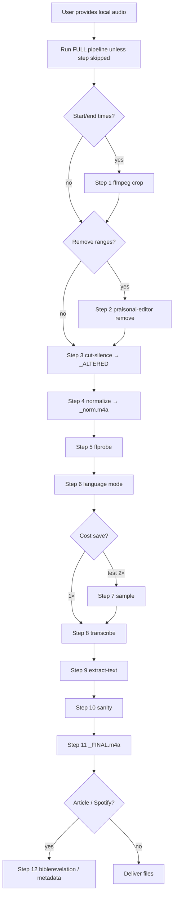

# Reference — sermon transcribe (full local pipeline)

## Full pipeline decision tree



## One-shot shell skeleton

```bash
bash -lc 'cd ~/praisonai-audio-editor && \
  SRC="/path/to/sermon.wav" && STEM="gal_2_17m20_to_56m20" && \
  # Step 1 crop (optional)
  # ffmpeg -y -nostdin -i "$SRC" -ss 17:20 -to 56:20 -c copy "${STEM}.wav" && \
  AUDIO="${STEM}.wav" && \
  # Step 2 remove (optional)
  # python3 -m praisonai_editor remove "$AUDIO" -r 11:53-12:43 -o "${STEM}_cut.wav" && AUDIO="${STEM}_cut.wav" && \
  # Step 3 silence
  python3 mac/cut-silence.py "$AUDIO" && AUDIO="${STEM}_ALTERED.wav" && \
  # Step 4 normalise
  ffmpeg -hide_banner -nostdin -i "$AUDIO" -af volumedetect -f null - 2>&1 | grep volume && \
  python3 -m praisonai_editor normalize "$AUDIO" -o "${STEM}_norm.m4a" && \
  AUDIO="${STEM}_norm.m4a" && ln -sf "$(realpath "$AUDIO")" "${STEM}_FINAL.m4a" && \
  # Step 8–9 transcribe
  python3 -m praisonai_editor transcribe "$AUDIO" --format json \
    -o "${STEM}_FINAL.transcript.json" 2>&1 | tee "${STEM}_FINAL_transcribe.log" && \
  python3 -m praisonai_editor extract-text "${STEM}_FINAL.transcript.json"'
```

## Language behaviour

| Flag | Whisper behaviour | Use when |
|------|-------------------|----------|
| *(none)* | Auto-detect dominant lang per chunk | Tamil sermon + English Bible quotes |
| `--language ta` | Forces Tamil tokenizer | Pure Tamil only |
| `--language en` | Forces English | English-dominant podcasts |

**Observed on Galatians clip (31:49):**

| Run | Words | Text len | English |
|-----|-------|----------|---------|
| `--language ta` | 412 | 3,589 | Garbled |
| 1× auto-detect | 1,983 | 11,709 | `Galatians`, `faith`, … |
| 2× auto-detect | 110 | 972 | Repetition, unusable |

## Volume normalise

Target: **−16 LUFS**, **−1.5 dBTP**.

```bash
python3 -m praisonai_editor normalize INPUT -o OUTPUT.m4a
python3 -m praisonai_editor normalize INPUT.m4a --in-place
python3 -m praisonai_editor normalize INPUT --in-place --force   # hot peaks
```

`normalize` encodes AAC — use `-o …m4a` for `.wav` sources (do not `--in-place` on wav).

| Symptom | Fix |
|---------|-----|
| Quiet on Spotify | Step 4 was skipped — re-run normalize |
| Peaks near 0 dB | `--force` loudnorm |
| Already optimal | CLI copies file; still report mean/max |

## Remove time ranges

```bash
python3 -m praisonai_editor remove "$AUDIO" --range "11:53-12:43" -o "${STEM}_cut.wav"
```

```python
from praisonai_editor import remove_time_ranges
remove_time_ranges("sermon.wav", ["11:53-12:43"], output_path="sermon_cut.wav")
```

## Silence cut

```bash
CUT_SILENCE_NOISE_DB=-30 python3 mac/cut-silence.py "$AUDIO"
```

Default **−30 dB** peak for Tamil sermon room noise.

## API cost (whisper-1)

~$0.006/min of audio sent. `--speed 2` halves billed minutes after quality gate.

## Troubleshooting

| Symptom | Fix |
|---------|-----|
| Agent stopped after transcribe | Re-read SKILL golden rule — run Steps 3–4 |
| English garbled | Omit `--language ta` |
| Short transcript at 2× | Re-run 1× auto-detect |
| Transcript timestamps wrong after cuts | Transcribe **after** all edits; use FINAL file |

## Related workflows

| Task | Skill |
|------|-------|
| YouTube → download → crop → normalise | `youtube-clip-transcribe` |
| Transcript → article | `biblerevelation-sermon-articles` |
| Time-range cut | `praisonai-editor remove` |
| Phrase trim | `praisonai-editor trim` |
