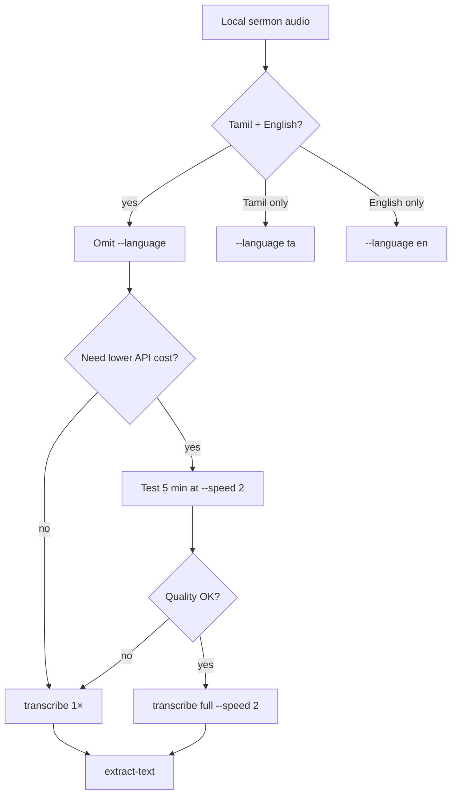

# Reference — sermon transcribe (Tamil + English + speed)

## Decision tree



## Language behaviour

| Flag | Whisper behaviour | Use when |
|------|-------------------|----------|
| *(none)* | Auto-detect dominant lang per chunk | Tamil sermon + English Bible quotes |
| `--language ta` | Forces Tamil tokenizer | Pure Tamil only |
| `--language en` | Forces English | English-dominant podcasts |

**Observed on Galatians clip (31:49):**

| Run | Words | Text len | English |
|-----|-------|----------|---------|
| `--language ta` | 412 | 3,589 | Garbled (`opera`, `articles`) |
| 1× auto-detect | 1,983 | 11,709 | `Galatians`, `Here`, `faith`, … |
| 2× auto-detect | 110 | 972 | Repetition, unusable |

## API cost (whisper-1)

Billed per **minute of audio file** sent (~$0.006/min).

| Duration | 1× cost | 2× cost |
|----------|---------|---------|
| 32 min | ~$0.19 | ~$0.10 |
| 60 min | ~$0.36 | ~$0.18 |

`--speed 2` in `praisonai_editor` applies ffmpeg `atempo` before upload and multiplies word timestamps ×2 in the result.

Alternative: `gpt-4o-mini-transcribe` (~$0.003/min at 1×) — not default in CLI; pass `--model` if enabled in your OpenAI account.

## Commands

### Standard (recommended for Tamil+English)

```bash
bash -lc 'cd ~/praisonai-audio-editor && \
  AUDIO="Double Blessings for Preaching the True Gospel Galatians 1.wav" && \
  python3 -m praisonai_editor transcribe "$AUDIO" --format json \
    -o "${AUDIO%.wav}.transcript.json" \
    2>&1 | tee "${AUDIO%.wav}_transcribe.log" && \
  python3 -m praisonai_editor extract-text "${AUDIO%.wav}.transcript.json"'
```

### With 2× speed (after 5 min sample passes)

```bash
python3 -m praisonai_editor transcribe "$AUDIO" --format json --speed 2 \
  -o "${STEM}.transcript.json"
```

### 5 min quality sample

```bash
ffmpeg -y -nostdin -i "$AUDIO" -t 300 -c copy /tmp/sample.m4a
python3 -m praisonai_editor transcribe /tmp/sample.m4a --format txt --speed 2
# Inspect output length and repetition before full run
```

### Manual 2× + timestamp scale (if not using --speed)

If you transcribe a pre-sped file without `--speed`, scale JSON manually:

```python
import json
SPEED = 2.0
d = json.load(open("STEM.transcript.json"))
for w in d["words"]:
    w["start"] = round(w["start"] * SPEED, 3)
    w["end"] = round(w["end"] * SPEED, 3)
d["duration"] = round(d["duration"] * SPEED, 3)
json.dump(d, open("STEM.transcript.json", "w"), indent=2)
```

Prefer `--speed 2` on the **original** file — scaling is automatic.

## TranscriptResult fields

```json
{
  "text": "…",
  "words": [{"text": "…", "start": 0.0, "end": 0.52, "confidence": 1.0}],
  "language": "tamil",
  "duration": 1909.1
}
```

`language` is dominant detected language, not per-segment labels.

## Troubleshooting

| Symptom | Fix |
|---------|-----|
| English words garbled | Remove `--language ta`; use auto-detect |
| Short transcript, repeated lines | 2× too fast — re-run 1× |
| `OPENAI_API_KEY` missing | `bash -lc` with `~/.bashrc` |
| Timeout on long file | Use praisonai-editor (chunked), not raw API |
| Wrong duration in JSON | After manual 2× file, scale timestamps ×2 |

## Related workflows

| Task | Skill |
|------|-------|
| YouTube → crop → normalise | `youtube-clip-transcribe` |
| Silence cut (autoedit) | `mac/autoedit-audio.sh` / `cut-silence.py` |
| Phrase trim | `praisonai-editor trim` — see youtube `reference.md` |
