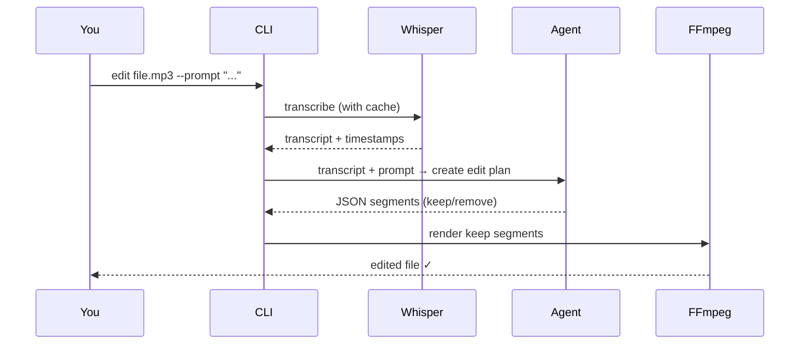

# AI Agent Prompt-Based Editing

Edit media using plain English instructions. An AI agent interprets your prompt and creates a precise edit plan.

## Usage

```bash
praisonai-editor edit interview.mp3 \
  --prompt "Remove the intro, any weather discussion, and keep only the technical part"
```

## How it works



## Prompt examples

=== "Remove intro"

    ```bash
    praisonai-editor edit podcast.mp3 \
      --prompt "Remove the first 5 minutes of introduction"
    ```

=== "Remove off-topic sections"

    ```bash
    praisonai-editor edit interview.mp3 \
      --prompt "Remove any discussion about weather or personal anecdotes, keep technical content only"
    ```

=== "Keep specific section"

    ```bash
    praisonai-editor edit lecture.mp3 \
      --prompt "Keep only the question and answer section at the end"
    ```

!!! info "Fallback"
    If the agent cannot parse its own output, it falls back to the heuristic `podcast` preset automatically.

## Python API

```python
from praisonai_editor.agent_pipeline import prompt_edit

result = prompt_edit(
    "interview.mp3",
    "Remove the intro and keep only technical discussion",
    output_path="interview_edited.mp3",
    verbose=True,
)
```
