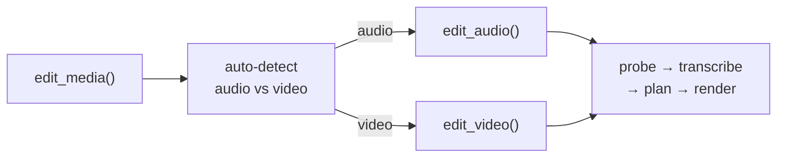

# Python API Overview

Use praisonai-editor directly from Python — no CLI needed.

## Core entry point

```python
from praisonai_editor.pipeline import edit_media

result = edit_media("podcast.mp3", preset="podcast", verbose=True)
print(result.output_path)    # "podcast_edited.mp3"
print(result.success)        # True
```

## Pipeline flow



## Module layout

| Module | Key exports |
|--------|------------|
| `pipeline` | `edit_media`, `edit_audio`, `edit_video` |
| `probe` | `probe_media`, `FFmpegProber` |
| `transcribe` | `transcribe_audio`, `OpenAITranscriber`, `LocalTranscriber` |
| `convert` | `convert_media` |
| `plan` | `create_edit_plan`, `HeuristicEditor` |
| `detect` | `create_content_plan` |
| `render` | `FFmpegAudioRenderer`, `FFmpegVideoRenderer` |
| `_demix` | `isolate_vocals`, `has_demucs` |
| `models` | `EditPlan`, `EditResult`, `TranscriptResult`, `ProbeResult` |
| `protocols` | `Transcriber`, `Editor`, `Renderer`, `Prober`, `Converter` |
