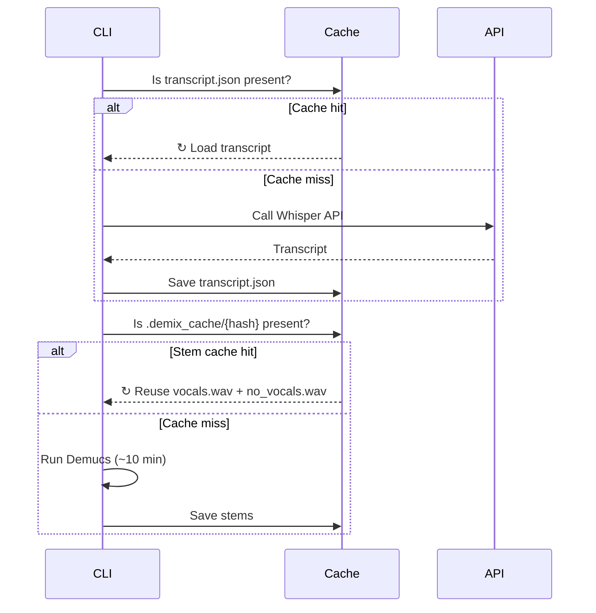

# Artifacts & Caching

Every `edit` or `transcribe` run saves artifacts to `~/.praisonai/editor/{filename}/`.

## What is saved

```
~/.praisonai/editor/{filename}/
  ├── probe.json           ← media metadata
  ├── transcript.json      ← word-level timestamps (CACHED)
  ├── transcript.srt       ← SRT subtitles
  ├── transcript.txt       ← plain text
  ├── plan.json            ← edit decisions (keep/remove segments)
  └── content_blocks.json  ← detection blocks (only with --detector)

~/.praisonai/editor/.demix_cache/{sha256}/
  ├── vocals.wav           ← separated vocals (CACHED)
  └── no_vocals.wav        ← instruments (CACHED)
```

## Caching behaviour



## Disable artifact saving

```bash
praisonai-editor edit podcast.mp3 --no-artifacts
```

## Clear caches

```bash
# Remove transcript cache for a specific file
rm ~/.praisonai/editor/podcast/transcript.json

# Remove all stem caches
rm -rf ~/.praisonai/editor/.demix_cache/

# Remove everything
rm -rf ~/.praisonai/editor/
```

## `probe.json` example

```json
{
  "path": "podcast.mp3",
  "duration": 1823.45,
  "has_video": false,
  "audio_codec": "mp3",
  "audio_sample_rate": 44100,
  "audio_channels": 2,
  "size_bytes": 44352512
}
```

## `plan.json` example

```json
{
  "original_duration": 1823.4,
  "edited_duration": 1680.2,
  "removed_duration": 143.2,
  "removal_summary": {"filler": 12.3, "silence": 122.8, "repetition": 8.1},
  "segments": [
    {"start": 0, "end": 5.2, "action": "keep", "category": "content"},
    {"start": 5.2, "end": 5.8, "action": "remove", "category": "filler", "reason": "Filler: 'um'"}
  ]
}
```

## `content_blocks.json` example

```json
{
  "resolved": [
    {
      "start": 0.0, "end": 367.0,
      "type": "singing",
      "detector": "ensemble",
      "rms_db": -18.5,
      "confidence": 0.91
    }
  ]
}
```
