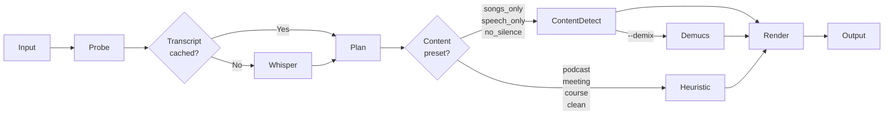

# `edit` — Full editing pipeline

The main command. Runs transcription → content detection → plan → render in one shot.

## Usage

```bash
praisonai-editor edit INPUT [OPTIONS]
```

## All Options

| Option | Short | Default | Description |
|--------|-------|---------|-------------|
| `INPUT` | | | Input media file (audio or video) |
| `--output` | `-o` | `{stem}_edited.{ext}` | Output file path |
| `--preset` | `-p` | `podcast` | Edit preset (see [Presets](../presets/index.md)) |
| `--prompt` | | | Natural language instruction (AI agent) |
| `--detector` | | `auto` | Content detector: `auto` · `ensemble` · `ina` · `librosa` · `ffmpeg` |
| `--demix` | | off | Enable Demucs vocal stem separation |
| `--primary-zone` | | off | Crop to primary singing zone only |
| `--no-fillers` | | off | Keep filler words (don't remove) |
| `--no-repetitions` | | off | Keep repetitions |
| `--no-silence` | | off | Keep silences |
| `--local` | | off | Use offline faster-whisper |
| `--language` | | auto | Language code (`en`, `ta`, `es`, …) |
| `--reencode` | | off | Re-encode instead of stream copy (slower, better quality) |
| `--no-artifacts` | | off | Don't save artifacts to `~/.praisonai/editor/` |
| `--verbose` | `-v` | off | Print step-by-step progress |

---

## Pipeline overview



---

## Examples

=== "Podcast (default)"

    ```bash
    praisonai-editor edit podcast.mp3 -v
    ```
    Removes: fillers · repetitions · silences > 1.5s

=== "Keep only songs"

    ```bash
    praisonai-editor edit concert.mp3 \
      --preset songs_only \
      --detector ensemble \
      --demix \
      --primary-zone \
      -v
    ```

=== "Speech only (remove music)"

    ```bash
    praisonai-editor edit radio.mp3 --preset speech_only --detector ensemble
    ```

=== "Video meeting cleanup"

    ```bash
    praisonai-editor edit meeting.mp4 --preset meeting -v
    ```

=== "AI agent edit"

    ```bash
    praisonai-editor edit interview.mp3 \
      --prompt "Remove the intro and any off-topic discussion"
    ```

=== "Tamil language"

    ```bash
    praisonai-editor edit audio.mp3 --language ta -v
    ```

=== "Offline"

    ```bash
    pip install "praisonai-editor[local]"
    praisonai-editor edit audio.mp3 --local -v
    ```

---

## Artifacts saved

```
~/.praisonai/editor/{filename}/
  ├── probe.json
  ├── transcript.json   ← cached — reused on second run
  ├── transcript.srt
  ├── transcript.txt
  ├── plan.json
  └── content_blocks.json  ← only with --detector
```

Use `--no-artifacts` to skip saving.

---

## Python API

```python
from praisonai_editor.pipeline import edit_media

result = edit_media(
    "podcast.mp3",
    output_path="podcast_clean.mp3",
    preset="podcast",
    verbose=True,
)

print(result.success)          # True
print(result.output_path)      # "podcast_clean.mp3"
print(result.plan.removed_duration)  # seconds removed
```
