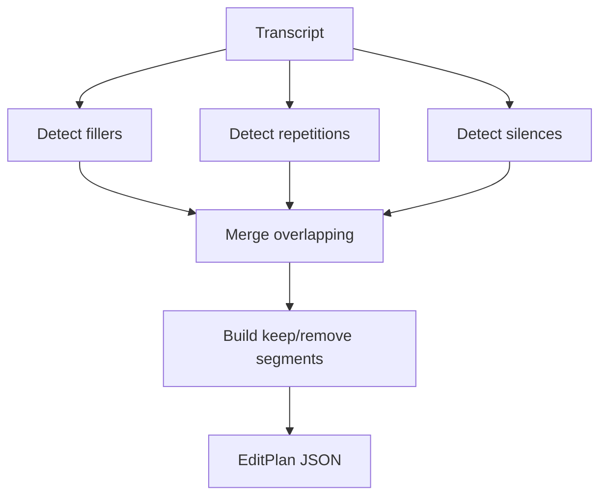

# `plan` — Preview the edit plan

See what would be removed *before* actually editing the file.

## Usage

```bash
praisonai-editor plan INPUT [OPTIONS]
```

## Options

| Option | Short | Default | Description |
|--------|-------|---------|-------------|
| `INPUT` | | | Media file to plan |
| `--output` | `-o` | stdout | Save plan as JSON |
| `--preset` | `-p` | `podcast` | Edit preset |
| `--local` | | False | Use local Whisper |

## Examples

=== "Preview podcast plan"

    ```bash
    praisonai-editor plan podcast.mp3 --preset podcast
    ```

    ```json
    {
      "original_duration": 1823.4,
      "edited_duration": 1680.2,
      "removed_duration": 143.2,
      "removal_summary": {
        "filler": 12.3,
        "repetition": 8.1,
        "silence": 122.8
      }
    }
    ```

=== "Save plan to file"

    ```bash
    praisonai-editor plan podcast.mp3 --output plan.json
    ```

## Plan structure



!!! info "No file is modified"
    `plan` only analyzes and outputs JSON — your file stays untouched.
