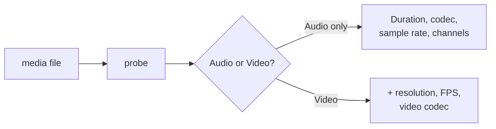

# `probe` — Inspect media metadata

Use `probe` to quickly check the metadata of any audio or video file.

## Usage

```bash
praisonai-editor probe INPUT [OPTIONS]
```

## Options

| Option | Description |
|--------|-------------|
| `INPUT` | Path to media file (MP3, MP4, WAV, …) |
| `--output FILE` | Save result as JSON file |
| `--json` | Print full JSON to stdout |

## Examples

=== "Basic"

    ```bash
    praisonai-editor probe podcast.mp3
    ```

    Output:
    ```
    File: podcast.mp3
    Duration: 1823.45s
    Type: Audio only
    Audio codec: mp3
    Audio: 44100Hz, 2ch
    Size: 42.30 MB
    ```

=== "JSON output"

    ```bash
    praisonai-editor probe video.mp4 --json
    ```

    ```json
    {
      "path": "video.mp4",
      "duration": 3600.0,
      "has_video": true,
      "audio_codec": "aac",
      "audio_sample_rate": 48000,
      "audio_channels": 2,
      "video_codec": "h264",
      "width": 1920,
      "height": 1080,
      "fps": 30.0,
      "size_bytes": 524288000
    }
    ```

=== "Save to file"

    ```bash
    praisonai-editor probe file.mp3 --output meta.json
    ```

## What is `probe` useful for?



!!! tip "Python API"
    ```python
    from praisonai_editor.probe import probe_media

    info = probe_media("podcast.mp3")
    print(info.duration)       # 1823.45
    print(info.is_audio_only)  # True
    ```
