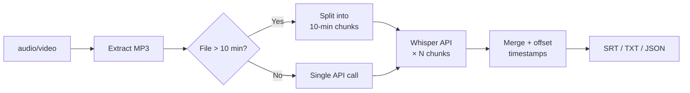

# `transcribe` — Audio/video to text

Transcribe any audio or video file with word-level timestamps.

## Usage

```bash
praisonai-editor transcribe INPUT [OPTIONS]
```

## Options

| Option | Short | Default | Description |
|--------|-------|---------|-------------|
| `INPUT` | | | Audio or video file |
| `--output` | `-o` | stdout | Output file path |
| `--format` | `-f` | `srt` | Output format: `srt`, `txt`, `json` |
| `--local` | | False | Use offline faster-whisper |
| `--language` | | auto | Language code e.g. `en`, `ta`, `es` |

## Examples

=== "SRT subtitles"

    ```bash
    praisonai-editor transcribe video.mp4 --format srt --output video.srt
    ```

    ```
    1
    00:00:00,000 --> 00:00:03,240
    Welcome everyone to today's session.

    2
    00:00:03,800 --> 00:00:07,100
    We'll be covering the main topics.
    ```

=== "Plain text"

    ```bash
    praisonai-editor transcribe podcast.mp3 --format txt
    ```

=== "JSON with timestamps"

    ```bash
    praisonai-editor transcribe audio.mp3 --format json --output words.json
    ```

    ```json
    {
      "text": "Welcome everyone to today's session.",
      "words": [
        {"text": "Welcome", "start": 0.0, "end": 0.52, "confidence": 0.99},
        {"text": "everyone", "start": 0.58, "end": 1.10, "confidence": 0.99}
      ],
      "language": "en",
      "duration": 1823.4
    }
    ```

=== "Tamil (non-English)"

    ```bash
    praisonai-editor transcribe audio.mp3 --language ta
    ```

=== "Offline"

    ```bash
    pip install "praisonai-editor[local]"
    praisonai-editor transcribe audio.mp3 --local
    ```

## How it works



!!! info "Transcript cache"
    After transcribing, the result is cached at `~/.praisonai/editor/{file}/transcript.json`.
    Running `edit` on the same file loads from cache — **no repeat API calls**.

!!! tip "Python API"
    ```python
    from praisonai_editor.transcribe import transcribe_audio

    result = transcribe_audio("podcast.mp3", language="en")
    print(result.text)       # full text
    print(result.to_srt())   # SRT subtitles
    for w in result.words:
        print(w.start, w.text)
    ```
