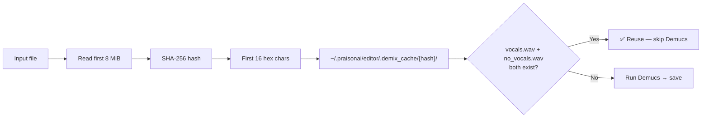

# Stem Cache

Demucs stem separation is slow on CPU (5–15 min for a 40-min file). The stem cache ensures it only runs **once per file**.

## How the cache key works



## Cache location

```
~/.praisonai/editor/.demix_cache/
  └── a78a770eb2572ef6/
        ├── vocals.wav      (424 MB)
        └── no_vocals.wav   (424 MB)
```

## Timing example

| Run | Time |
|-----|------|
| First run (40-min file, CPU) | ~10 min |
| Second run (cache hit) | ~8 sec |

## Clear the cache

```bash
rm -rf ~/.praisonai/editor/.demix_cache/
```

## Python check

```python
from praisonai_editor._demix import has_demucs, isolate_vocals
print(has_demucs())  # True / False
```
