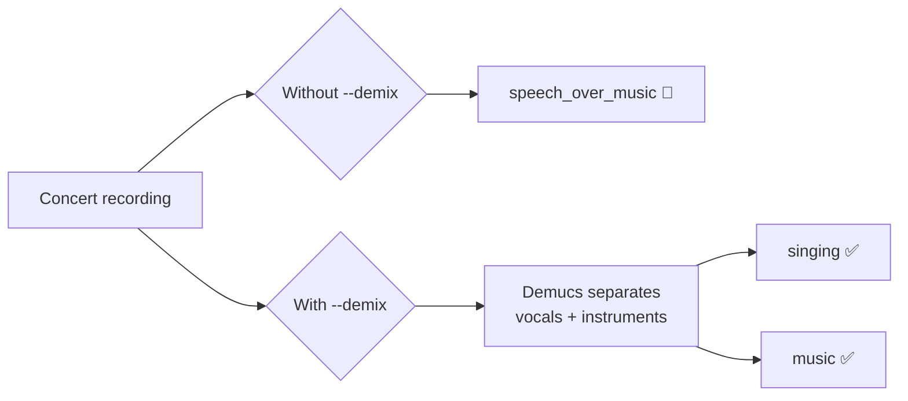

# 🎵 Stem Separation (Demix)

Powered by [Demucs](https://github.com/facebookresearch/demucs) — an AI model that separates audio into vocal and instrument tracks.

## Why stem separation?

Without demix, a segment where someone sings over a backing track is labeled `speech_over_music` — ambiguous.

With demix, that segment becomes precisely classified as `singing` — enabling clean extraction.



## Install

```bash
pip install "praisonai-editor[demix]"
```

## Usage

```bash
praisonai-editor edit concert.mp3 \
  --preset songs_only \
  --detector ensemble \
  --demix \
  --primary-zone \
  -v
```

## What Demucs separates

| Stem | File | Description |
|------|------|-------------|
| `vocals` | `vocals.wav` | Isolated vocal track |
| `no_vocals` | `no_vocals.wav` | All instruments (no voice) |

## Stem cache

The first run is slow (CPU inference on a 40-min file ≈ 10 min). After that, stems are cached forever:

```
~/.praisonai/editor/.demix_cache/{sha256_hash}/
  ├── vocals.wav       (first 8 MiB SHA-256 hash → unique per file)
  └── no_vocals.wav
```

Second run is ~8 seconds. See [Stem Cache](cache.md) for details.

## Supported models

| Model | Notes |
|-------|-------|
| `mdx_extra` | Default — best quality |
| `htdemucs` | More stems (drums, bass, etc.) |
| `mdx_extra_q` | Quantized — lower memory |

## Python API

```python
from praisonai_editor._demix import isolate_vocals, has_demucs

if has_demucs():
    vocals_path, inst_path = isolate_vocals(
        "concert.mp3",
        model_name="mdx_extra",  # default
        device="cpu",            # or "mps" for Apple Silicon
        verbose=True,
    )
```
