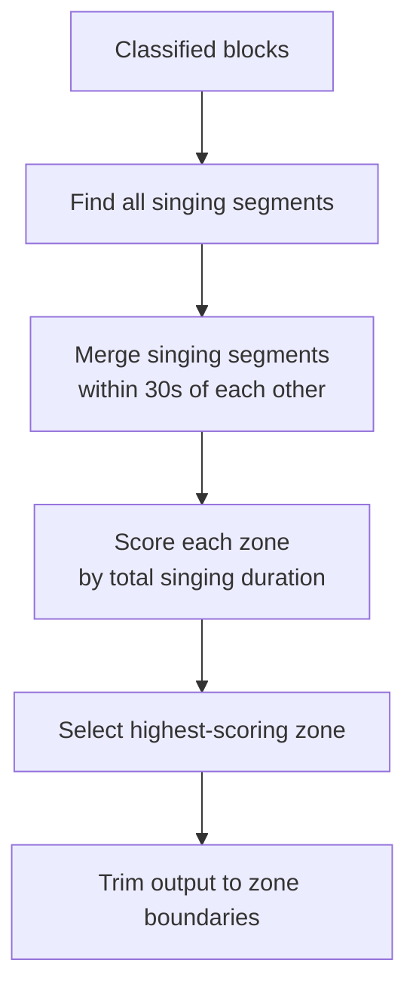

# Primary Zone Detection (`--primary-zone`)

Automatically finds and extracts the **main singing section** from a long recording.

## What is a singing zone?

A singing zone is a contiguous block where `singing` segments are close together. The **primary zone** is the longest/most significant zone — usually the main performance.

## Example

A 40-min live recording might contain:

```
00:00 – 05:20  🗣️ Talking / intro
05:20 – 27:13  🎵 Main singing performance  ← PRIMARY ZONE
27:13 – 30:00  🗣️ Talking / outro
30:00 – 35:00  🎵 Short bonus songs
```

`--primary-zone` crops the output to `05:20–27:13` automatically.

## Usage

```bash
praisonai-editor edit concert.mp3 \
  --preset songs_only \
  --detector ensemble \
  --demix \
  --primary-zone \
  -v
```

!!! note "Requires `--demix`"
    Primary zone detection works best with Demucs stem separation, which precisely identifies `singing` vs `music`.

## How the algorithm works



## Python API

```python
result = edit_media(
    "concert.mp3",
    preset="songs_only",
    detector="ensemble",
    demix=True,
    primary_zone_only=True,
)
```
