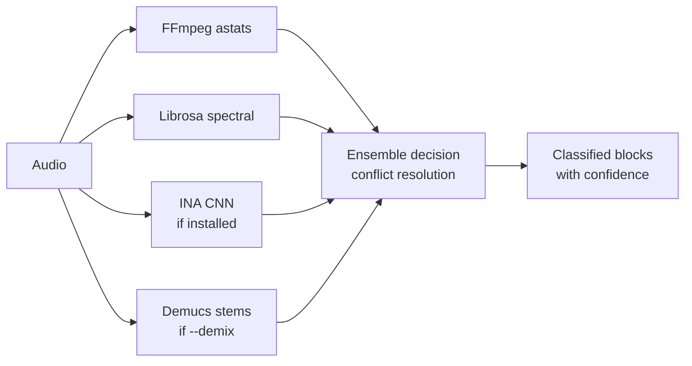

# Ensemble detector (`--detector ensemble`)

The recommended detector. Combines multiple detectors and uses a voting algorithm to pick the most confident classification for each segment.

## Usage

```bash
praisonai-editor edit file.mp3 --preset songs_only --detector ensemble
```

The `--detector auto` option also routes to ensemble.

## How it works



**Conflict resolution rules:**
- If INA is available → INA has highest priority for speech/music boundaries
- If Demucs is used → demix scores refine singing vs talking-over-music
- FFmpeg provides base signal statistics for all segments

## Confidence scores

Each block gets a `confidence` score (0–1). Low-confidence borders are re-classified using weighted voting from all available detectors.
