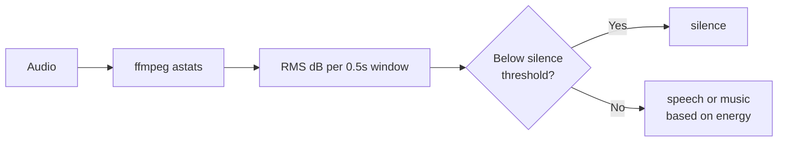

# FFmpeg heuristic detector (`--detector ffmpeg`)

Fastest detector. Uses FFmpeg's `astats` filter to get RMS/peak energy statistics per segment.

## Usage

```bash
praisonai-editor edit file.mp3 --preset no_silence --detector ffmpeg
```

## How it works



## When to use `ffmpeg`

- Very long files where speed matters
- Simple silence removal only (`--preset no_silence`)
- When you don't need precise speech/music classification
- Final step in a pipeline after rough cutting

## Limitations

- Cannot distinguish speech from music
- No machine learning — accuracy is heuristic only
