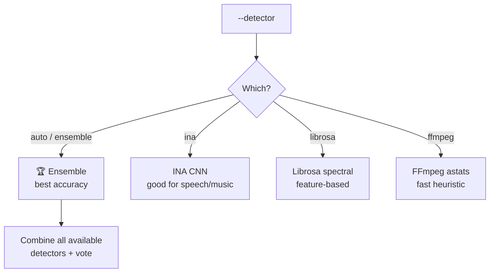

# Content Detection Overview

Content detection classifies each second of your media into types like `speech`, `music`, `singing`, `silence` — enabling smart content-based editing.

## When is detection used?

Detection is required for these presets:

| Preset | What it removes |
|--------|----------------|
| `songs_only` | Keeps music + singing |
| `speech_only` | Keeps speech |
| `no_silence` | Removes silence only |

## Available detectors



## Detector comparison

| Detector | Speed | Accuracy | Extra install? |
|----------|-------|----------|---------------|
| `ensemble` | ⭐⭐⭐ | ⭐⭐⭐⭐⭐ | No |
| `ina` | ⭐⭐ | ⭐⭐⭐⭐ | `[detect]` |
| `librosa` | ⭐⭐⭐ | ⭐⭐⭐ | No |
| `ffmpeg` | ⭐⭐⭐⭐⭐ | ⭐⭐ | No |

## Content block types

| Type | Description |
|------|-------------|
| `speech` | Clear speech, no music |
| `music` | Music without vocals |
| `singing` | Vocal melody / song |
| `speech_over_music` | Talking over music bed |
| `talking_over_music` | Speech detected on music (with demix) |
| `silence` | No significant audio |

## Usage

```bash
praisonai-editor edit file.mp3 --preset songs_only --detector ensemble
```

## Python API

```python
from praisonai_editor.detect import create_content_plan

plan, blocks, all_events = create_content_plan(
    "file.mp3", transcript, duration,
    keep_types=["music", "singing"],
    detector="ensemble",
    verbose=True,
)
```
