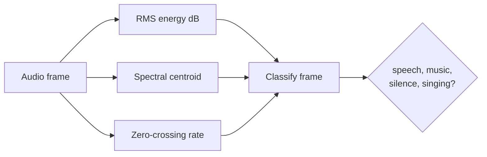

# Librosa spectral detector (`--detector librosa`)

Uses spectral features (RMS energy, spectral centroid, zero-crossing rate) from librosa to classify segments.

## Usage

```bash
praisonai-editor edit file.mp3 --preset songs_only --detector librosa
```

## How it works



## Strengths

- No extra install (librosa is a base dependency after install)
- Fast — runs on CPU without ML inference
- Works fine for clean recordings

## Weaknesses

- Less accurate than ensemble or INA on noisy or complex audio
- May confuse speech over music as pure music
