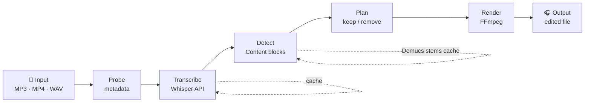

---
hide:
  - navigation
---

# PraisonAI Editor

> **AI-powered audio & video editor** — transcribe, clean, and edit media with one command.

<div class="grid cards" markdown>

-   :material-microphone:{ .lg } **Transcribe**

    ---
    Word-level timestamps in SRT, TXT, or JSON. OpenAI Whisper + local faster-whisper.

    [:octicons-arrow-right-24: transcribe](commands/transcribe.md)

-   :material-scissors-cutting:{ .lg } **Edit**

    ---
    Remove fillers, repetitions, silences, or keep only singing. One command.

    [:octicons-arrow-right-24: edit](commands/edit.md)

-   :material-music-note:{ .lg } **Stem Separation**

    ---
    Powered by Demucs — isolate vocals from instruments to find singing zones.

    [:octicons-arrow-right-24: demix](demix/index.md)

-   :material-robot:{ .lg } **AI Agent**

    ---
    *"Remove the intro and any off-topic discussion about weather"* — plain English.

    [:octicons-arrow-right-24: prompt edit](agent/prompt-edit.md)

</div>

---

## How it works



---

## Install in 30 seconds

```bash
pip install praisonai-editor
export OPENAI_API_KEY=sk-...
```

```bash
praisonai-editor edit podcast.mp3 -v
```

---

## Feature overview

| Feature | Command | Extra install? |
|---------|---------|---------------|
| Probe metadata | `probe` | No |
| Convert format | `convert` | No |
| Transcribe (Whisper) | `transcribe` | No |
| Create edit plan | `plan` | No |
| Edit (podcast/meeting/course…) | `edit` | No |
| Content detection (ensemble) | `edit --detector ensemble` | No |
| INA speech segmenter | `edit --detector ina` | `[detect]` |
| Stem separation (Demucs) | `edit --demix` | `[demix]` |
| Primary singing zone crop | `edit --demix --primary-zone` | `[demix]` |
| AI agent editing | `edit --prompt "…"` | No |
| Local Whisper | `edit --local` | `[local]` |
