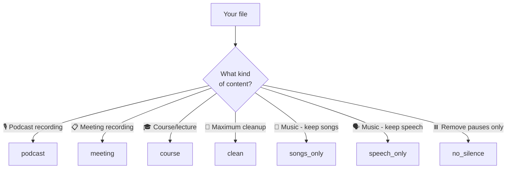

# Presets Overview

Presets are named editing profiles. Pick the one closest to your use case.



---

## Preset comparison

| Preset | Fillers | Repetitions | Silence | Min gap | Needs detector? |
|--------|---------|-------------|---------|---------|----------------|
| `podcast` | ✅ removed | ✅ removed | ✅ removed | 1.5s | No |
| `meeting` | ✅ removed | ❌ kept | ✅ removed | 2.0s | No |
| `course` | ✅ removed | ✅ removed | ✅ removed | 1.0s | No |
| `clean` | ✅ removed | ✅ removed | ✅ removed | 0.8s | No |
| `songs_only` | — | — | — | — | **Yes** |
| `speech_only` | — | — | — | — | **Yes** |
| `no_silence` | — | — | ✅ removed | — | **Yes** |

---

## Usage

```bash
praisonai-editor edit FILE --preset PRESET
```

Content presets also need `--detector`:
```bash
praisonai-editor edit FILE --preset songs_only --detector ensemble
```
