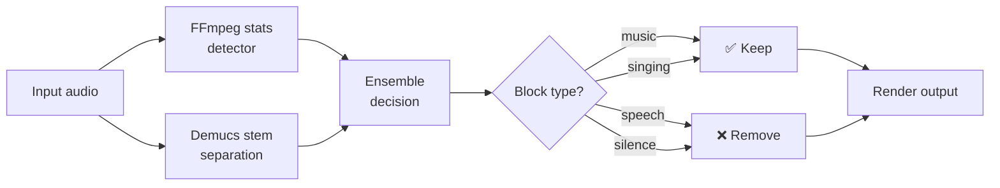
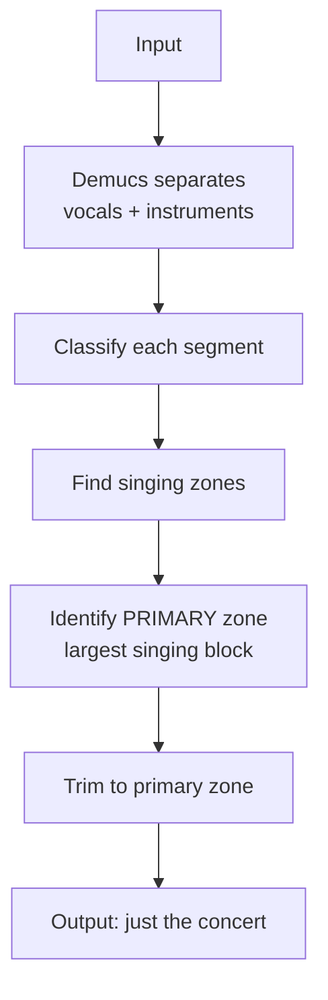

# `songs_only` preset

Extract only the singing/music portions from a recording. Removes speech, talking, and silence.

## What it keeps

- **Music** segments (instrumental sections)
- **Singing** segments (vocal melody)
- With `--demix`: only pure **singing** (vocals separated from instruments)

## Usage

```bash
# Basic
praisonai-editor edit concert.mp3 \
  --preset songs_only \
  --detector ensemble \
  -v

# Best quality — with Demucs stem separation
praisonai-editor edit concert.mp3 \
  --preset songs_only \
  --detector ensemble \
  --demix \
  --primary-zone \
  -v
```

## How content detection works



## With `--demix` and `--primary-zone`



!!! tip "Install Demucs"
    ```bash
    pip install "praisonai-editor[demix]"
    ```

## Python API

```python
from praisonai_editor.pipeline import edit_media

result = edit_media(
    "concert.mp3",
    preset="songs_only",
    detector="ensemble",
    demix=True,
    primary_zone_only=True,
    verbose=True,
)
```
