# Extending with Protocols

Every stage of the pipeline is defined as a Python Protocol — swap in your own implementation without touching core code.

## Architecture

```mermaid
classDiagram
    class Prober {
        +probe(path: str) ProbeResult
    }
    class Converter {
        +convert(input, output, bitrate) str
    }
    class Transcriber {
        +transcribe(audio_path, language) TranscriptResult
    }
    class Editor {
        +create_plan(transcript, duration ...) EditPlan
    }
    class Renderer {
        +render(input, output, plan, copy_codec) str
    }
    
    class FFmpegProber { implements Prober }
    class FFmpegConverter { implements Converter }
    class OpenAITranscriber { implements Transcriber }
    class LocalTranscriber { implements Transcriber }
    class HeuristicEditor { implements Editor }
    class FFmpegAudioRenderer { implements Renderer }
    class FFmpegVideoRenderer { implements Renderer }
```

## Custom implementations

Pick the protocol you want to replace:

- [Custom Transcriber](transcriber.md) — use your own speech-to-text engine
- [Custom Editor](editor.md) — write your own editing logic
- [Custom Renderer](renderer.md) — use your own rendering engine
