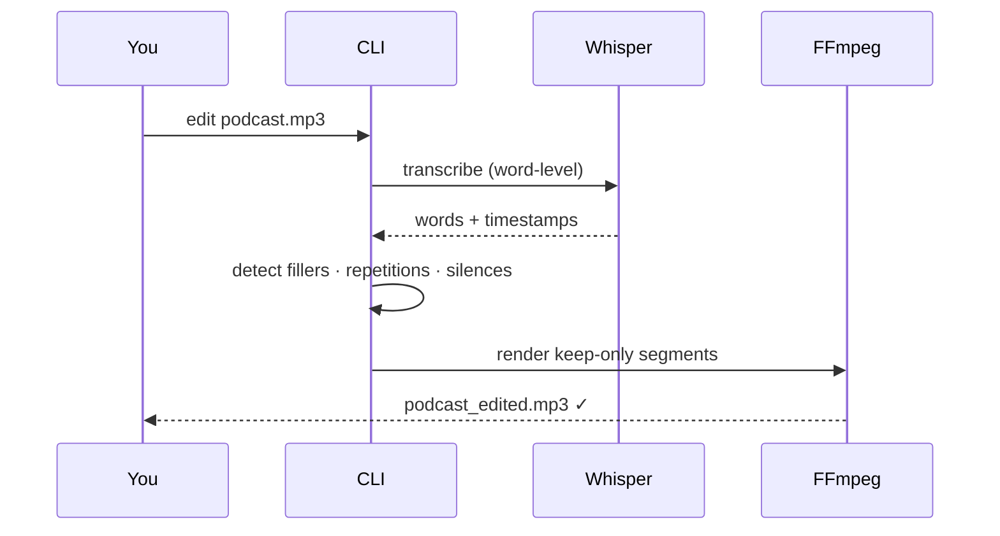

# Quick Start

Get from zero to an edited file in under 2 minutes.

## 1. Install

```bash
pip install praisonai-editor
```

```bash
export OPENAI_API_KEY=sk-...
```

!!! tip "Offline / local Whisper"
    ```bash
    pip install "praisonai-editor[local]"
    praisonai-editor edit podcast.mp3 --local
    ```

---

## 2. Edit a podcast

```bash
praisonai-editor edit podcast.mp3 -v
```

What this does:



---

## 3. Common recipes

=== "Podcast cleanup"

    ```bash
    praisonai-editor edit episode.mp3 --preset podcast -v
    ```

=== "Keep only singing"

    ```bash
    praisonai-editor edit concert.mp3 \
      --preset songs_only \
      --detector ensemble \
      --demix \
      --primary-zone \
      -v
    ```

=== "Meeting — remove silences only"

    ```bash
    praisonai-editor edit standup.mp4 --preset meeting -v
    ```

=== "AI natural language edit"

    ```bash
    praisonai-editor edit interview.mp3 \
      --prompt "Remove the intro, the weather tangent, and keep only the technical discussion"
    ```

=== "Transcribe to SRT"

    ```bash
    praisonai-editor transcribe video.mp4 --format srt --output subs.srt
    ```

=== "Convert MP4 → MP3"

    ```bash
    praisonai-editor convert video.mp4 --format mp3
    ```

---

## 4. Output files

After `edit`, you get:

```
podcast_edited.mp3        ← edited audio
~/.praisonai/editor/podcast/
  ├── probe.json          ← media metadata
  ├── transcript.json     ← word timestamps (cached)
  ├── transcript.srt      ← subtitles
  ├── transcript.txt      ← plain text
  ├── plan.json           ← edit decisions
  └── content_blocks.json ← detection blocks (if --detector)
```

!!! info "Transcript cache"
    Second run reuses `transcript.json` — no API call needed.
